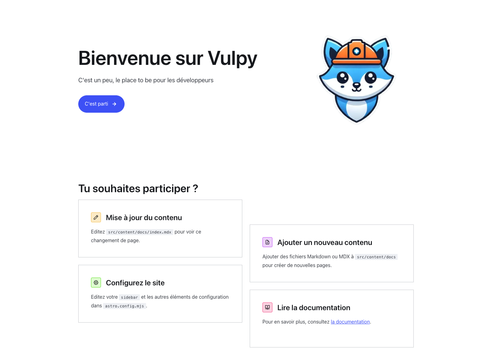

# Bienvenue sur Vulpy 🦊


[](https://twitter.com/Gorski_anthony)

## 📖 À propos

**Vulpy** est un projet open-source destiné à la documentation sur les bases du développement web.

🚀 Version actuelle : **v0.0.1**

## 🛠️ Installation

```sh
npm install
```

## 🚀 Utilisation

```sh
npm run dev
```

## 🎯 Fonctionnalités

-   ✅ Création du projet
-   ✅ Mettre en place l'environnement de développement
-   🔜 Créer la documentation pour la collaboration

## 🖼️ Aperçu



## 🤝 Contribution

Les contributions sont les bienvenues ! Voici comment participer :

1. **Fork** le projet
2. Crée une **branche feature** (`git checkout -b feature/ma-feature`)
3. **Commits** tes changements (`git commit -m 'Ajout de ma feature'`)
4. **Push** ta branche (`git push origin feature/ma-feature`)
5. **Ouvre une Pull Request** 🎉

## 👤 Auteur

👨‍💻 **Anthony Gorski**

-   𝕏 (Twitter) : [@Gorski_Anthony](https://twitter.com/Gorski_Anthony)
-   GitHub : [@GorskiAnthony](https://github.com/GorskiAnthony)

## ⭐ Affichez votre soutien

Si ce projet vous a aidé, **n'hésitez pas à laisser une étoile ⭐ sur GitHub** !

---

### 📌 Licence

```
MIT License
© 2024 Anthony Gorski
```
